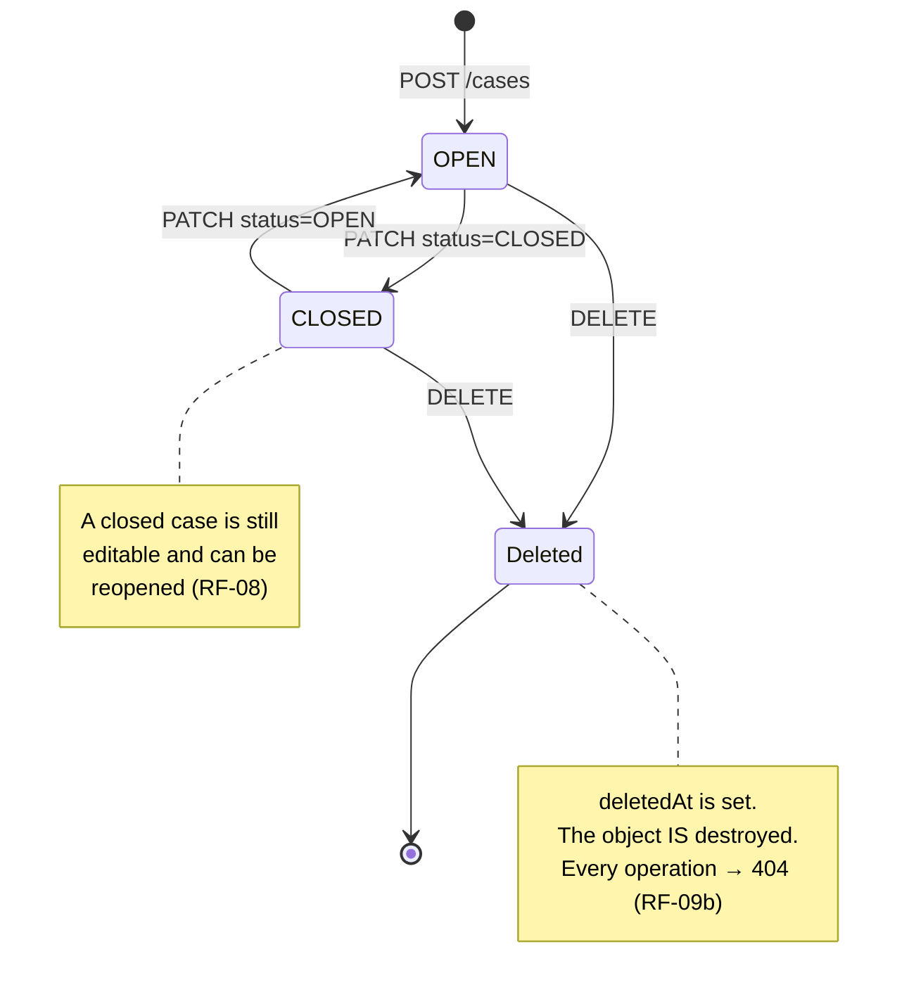
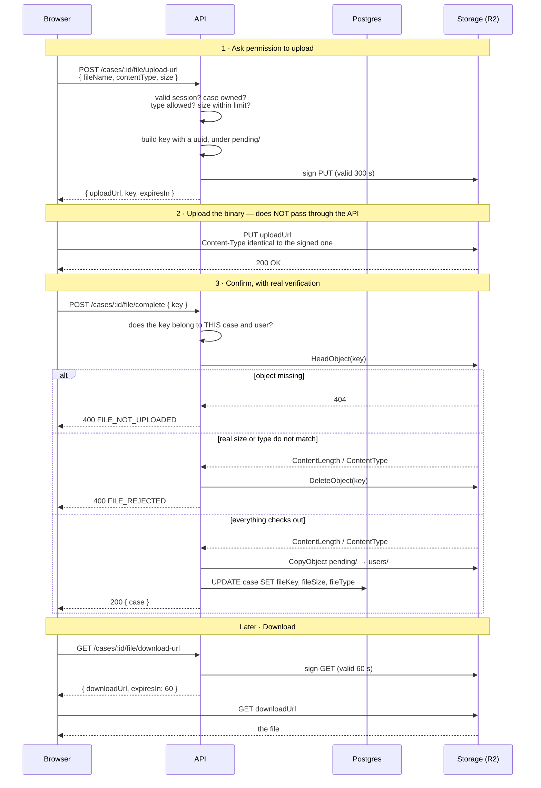

# Requirements — Evidence Manager API

Functional and non-functional requirements for the REST API. Each requirement has a stable
identifier used across issues, tests and code: searching for `RF-07` in the repository
returns the requirement, the issue that delivers it, the test that proves it and the code
that implements it.

Interface requirements (`RF-13`–`RF-20`) live in the web repository. Nothing is duplicated:
every requirement is defined in exactly one file.

---

## 1. Functional requirements

### 1.1 Authentication

| ID | Requirement |
|---|---|
| **RF-01** | Registration with email and password returns `201`. A duplicate email returns `409`. Invalid data returns `400` naming the offending field. **The password is stored only as a hash.** |
| **RF-01a** | The email is **trimmed** of surrounding spaces, validated up to **254 characters** and **normalised to lowercase** before being stored and before being queried. Without that, `Ana@x.com` and `ana@x.com` would create two accounts and the unique index would not prevent it; and a space left by pasting or autofill would reject a valid address as malformed. |
| **RF-01b** | The password is validated between **8 and 72 bytes**. The upper bound is not arbitrary: bcrypt reads only the first 72 bytes and discards the rest silently, so two different long passwords would open the same account. argon2 has no such limit, but the bound is kept so the algorithm can be changed without opening that hole. |
| **RF-02** | Login with valid credentials returns `200` with `{ id, email }` and an `httpOnly` session cookie — the body is the only way the client learns who signed in, since it cannot read the cookie. Invalid credentials return `401` **with the same message whether or not the email exists**, and **in the same time**: when the email does not exist the password is still checked against a placeholder hash, or the quicker answer would give the email away. The email is normalised before lookup. |
| **RF-02a** | The token expires **8 hours** after issuance — one working day, so it lapses overnight rather than mid-task. It carries only the user identifier and the email: an identity card, not a copy of the record. |
| **RF-03** | Current user lookup returns `200`. Without a session, `401`. |
| **RF-04** | Logout invalidates the cookie. |

### 1.2 Cases

| ID | Requirement |
|---|---|
| **RF-05** | Create a case with title and description, both required, returns `201`. Initial status `OPEN`, no file. |
| **RF-06** | List returns `200` with `{ items: [...] }`, containing **only the authenticated user's cases**, excluding deleted ones. At most 100 per response. Optional filter by status and ordering by update time, creation time or title; update time descending by default. |
| **RF-07** | Read one returns `200`. Non-existent returns `404`. Belonging to another user returns `403`. |
| **RF-07a** | A malformed identifier returns `400`, **before querying the database**. It differs from `404`: the request is malformed, not the resource missing. |
| **RF-08** | Update title, description or status returns `200`. Invalid returns `400`. Another user's returns `403`. **`CLOSED → OPEN` is allowed.** |
| **RF-08a** | An empty body, or one with no recognised field, returns `400`. Without this rule the request would succeed without changing anything **yet alter the update timestamp**, pushing the case to the top of the list for no reason. |
| **RF-09** | Delete returns `204`. The object is destroyed in storage **first**, then the record is marked as deleted and its file reference cleared. If destroying the object fails, **the database is not touched** and an error is returned: retrying is safe, because deleting an object that no longer exists does not fail. |
| **RF-09b** | **A deleted case does not exist for the API.** Reading, updating or deleting it again returns `404`, even knowing its identifier, and it never appears in the list. The guarantee lives in the middleware that loads the case, which every `/cases/:id` route passes through — not route by route. |

### 1.3 Evidence

| ID | Requirement |
|---|---|
| **RF-10** | Request an upload link with file name, type and size, returning `{ uploadUrl, key, expiresIn }`. A type outside the allowlist returns `400`. A declared size above the limit returns `400`. Another user's case returns `403`. **The allowlist and the size limit are configurable per environment**, not constants in code. The signed key points at a **temporary area** (`pending/`), not at its final location. |
| **RF-11** | Confirming the upload persists the file reference **only after verifying against storage** that: the object exists, its real size is within the limit, its real type matches what was signed, and its key belongs to that case and user. If the object is missing, `400`. If size or type do not match, **the object is destroyed** and `400` is returned. |
| **RF-11b** | Once verified, the object is moved from the temporary area to its final location. **An upload that is never confirmed stays in the temporary area and storage destroys it after 24 hours**, through a bucket lifecycle rule — no scheduled process, which a serverless deployment could not host anyway. |
| **RF-12** | Request a download link, returning a signed URL valid for 60 seconds. A case with no file returns `404`. |

### 1.4 Response contract

| ID | Requirement |
|---|---|
| **RF-21** | Every error follows **RFC 9457** (*Problem Details for HTTP APIs*) with `Content-Type: application/problem+json`, always the same shape, without exception. |
| **RF-22** | Every error response carries the **request identifier**, which also appears on every log line of that request. Whoever reports a failure can quote it and their exact request is recovered. |
| **RF-23** | Every error carries a **stable machine-readable code** and, when the message depends on a value, the **parameters** needed to compose it. The text a person reads is decided by the client, not by the API. |

```json
400 {
  "title":  "Bad Request",
  "status": 400,
  "code":   "VALIDATION_ERROR",
  "errors": [
    { "field": "title", "code": "TOO_SHORT", "params": { "min": 3 } },
    { "field": "email", "code": "INVALID_FORMAT" }
  ],
  "requestId": "9bed7892-..."
}
```

An error that is not tied to a field carries its `params` at the top level:

```json
400 {
  "title":  "Bad Request",
  "status": 400,
  "code":   "FILE_TOO_LARGE",
  "params": { "max": 5242880 },
  "requestId": "3f9c2a1e-..."
}
```

The `params` are what make it work: without them a number cannot be interpolated into
another language without splitting the string. With them, adding a second language is one
more file.

How the fields are filled:

| Field | Value |
|---|---|
| `code` | The stable name the client switches on. The only field it needs. The full list lives in `src/shared/errors/error-codes.ts`: an error cannot be thrown with a code missing from it |
| `type` | Omitted. RFC 9457 then reads it as `about:blank`: the problem is what the status says, and `code` narrows it |
| `title` | The standard reason phrase of the status, as RFC 9457 asks when `type` is `about:blank`: `Not Found`, `Conflict`. Not shown to anyone |
| `requestId` | A UUID generated by the server for every request. One sent by the client is ignored, so nobody can plant ids in the logs |
| — | An unexpected failure answers `500` with `INTERNAL_ERROR`. Its message and stack go to the log only |
| — | A body that cannot be read is rejected when the route validates it, before any query: `400` with `UNREADABLE_BODY` (malformed JSON, a `Content-Type` other than JSON, a missing body, an unsupported charset) or `413` with `PAYLOAD_TOO_LARGE` and `{ max }` in bytes (over 100 KB). The body is only read there, so a route that does not exist answers `404` and an unauthenticated request answers `401` without the body ever being read. It applies to every endpoint that takes a body, so the endpoint map does not repeat it |

Every error also carries an English message written for developers. It goes to the log,
**never to the response**.

Each request leaves one log line, and it must be enough to diagnose a failure **without
reproducing it**: in production there is no going back for a missing detail. It carries
the request id, method, URL, user agent, status and response time; for a `4xx`, the error
code and message; for a `500`, the whole error with its stack. Headers and bodies are not
logged: they add nothing to a diagnosis and are where passwords and tokens travel.
`LOG_LEVEL` filters lines, never detail.

**Successful responses are not wrapped**: they return the resource, or `{ items, total }`
for lists. What needs a uniform shape is the error, because it is the only thing the client
handles in a single place.

---

## 2. Non-functional requirements

The requirements above say **what** the system does. These say **how it must behave**: not
features, but qualities. Each one justifies at least one technical decision; no technical
decision in this project exists without a requirement demanding it.

| ID | What must be true | How it is verified |
|---|---|---|
| **RNF-01** | **Nobody reaches anybody else's data.** Checked on the server on every single operation, never by hiding buttons in the interface | Test: user B against A's case → `403` |
| **RNF-02** | **A file cannot be reached without current permission.** There is no URL that works forever: every read is a link that expires | Private bucket · keys carrying a UUID · 60-second links |
| **RNF-03** | **A stolen page cannot steal the session.** The token is not readable by the JavaScript running on the page, so a script injected into it cannot take it | `httpOnly` cookie |
| **RNF-04** | **The server never trusts what the browser checked.** Anyone can skip the interface with `curl`, so every input is validated again on arrival. Client-side checks exist to give fast feedback, not to protect anything | Test: a request sent straight to the API, bypassing the interface |
| **RNF-05** | **Deleting does not erase the trail.** The record is marked as removed instead of being destroyed, so it is still possible to tell what existed and when it was withdrawn | Soft delete |
| **RNF-06** | **No endpoint can be asked for an unbounded amount of data.** A listing with no ceiling exhausts the server's memory long before anyone notices | Hard cap in the query |
| **RNF-07** | **A failure is understandable to us and opaque to the caller.** Errors are logged with enough context to find them; the client receives a code and a message, never a stack trace revealing how the system is built | Centralised error handler |
| **RNF-08** | **A rule is written once.** The same schema validates at runtime, produces the TypeScript type and generates the API documentation — so the three cannot drift apart and start disagreeing | Shared schemas |
| **RNF-09** | **Nothing is welded to one provider.** Storage is reached through an interface, and the application starts the same whether it runs as a serverless function or as a long-lived container | Storage port · application separated from its bootstrap |
| **RNF-10** | **Someone else can run this.** A person who has never seen the project brings the whole environment up with two commands. **Every start is a fresh environment**: the database is recreated and migrated from scratch, so nobody works against leftovers from a previous session | `npm run db:up` + `npm run dev` |
| **RNF-11** | **Required configuration is validated before the process accepts traffic.** If a required environment variable is missing, the process does not start, and the message names which one — instead of failing confusingly minutes or hours later, in the middle of a real operation | Zod schema over `process.env`, run on import |

---

## 3. Endpoint map

Each row reads as the script for its tests: **the error column is the list of cases to
cover.**

| Method | Path | Session | Ownership | Input | Success | Errors | Requirement |
|---|---|---|---|---|---|---|---|
| `POST` | `/auth/register` | — | — | email, password | `201` | `400` `409` | RF-01 |
| `POST` | `/auth/login` | — | — | email, password | `200` `{ id, email }` + cookie | `400` `401` | RF-02 |
| `GET` | `/auth/me` | ✓ | — | — | `200` | `401` | RF-03 |
| `POST` | `/auth/logout` | ✓ | — | — | `204` | `401` | RF-04 |
| `POST` | `/cases` | ✓ | — | title, description | `201` | `400` `401` | RF-05 |
| `GET` | `/cases` | ✓ | — | status, order, page, limit | `200` `{items}` | `400` `401` | RF-06 |
| `GET` | `/cases/:id` | ✓ | ✓ | — | `200` | `400` `401` `403` `404` | RF-07 |
| `PATCH` | `/cases/:id` | ✓ | ✓ | title, description, status | `200` | `400` `401` `403` `404` | RF-08 |
| `DELETE` | `/cases/:id` | ✓ | ✓ | — | `204` | `400` `401` `403` `404` `500` | RF-09 |
| `POST` | `/cases/:id/file/upload-url` | ✓ | ✓ | fileName, contentType, size | `200` | `400` `401` `403` `404` | RF-10 |
| `POST` | `/cases/:id/file/complete` | ✓ | ✓ | key | `200` | `400` `401` `403` `404` | RF-11 |
| `GET` | `/cases/:id/file/download-url` | ✓ | ✓ | — | `200` | `400` `401` `403` `404` | RF-12 |
| `GET` | `/health` | — | — | — | `200` | — | — |
| `GET` | `/openapi.json` | — | — | — | `200` | — | — |

**Ownership ✓** means the route passes through the middleware that loads the case and
checks it belongs to whoever is asking.

### Middleware order, and why

```ts
router.patch('/:id',
  requireAuth,                 // 1. cryptography. No database
  validateParams(idSchema),    // 2. is :id a UUID?     → 400
  validate(updateCaseSchema),  // 3. read the body, is it valid? → 400 / 413
  loadOwnedCase,               // 4. NOW the query      → 404 / 403
  update,                      // 5. the work
)
```

**Cheap before expensive.** A request carrying a malformed identifier and an invalid body
is rejected **without touching the database**. Validating after querying wastes a round
trip on every malformed request.

---

## 4. Flows

### Authentication

```mermaid
sequenceDiagram
    participant B as Browser
    participant A as API
    participant D as Postgres

    Note over B,D: Registration
    B->>A: POST /auth/register { email, password }
    A->>A: validate · normalise email to lowercase
    A->>D: does that email exist?
    alt already taken
        A-->>B: 409
    else available
        A->>A: argon2.hash(password)
        A->>D: INSERT user
        A-->>B: 201 { id, email }
    end

    Note over B,D: Login
    B->>A: POST /auth/login { email, password }
    A->>D: SELECT by normalised email
    A->>A: argon2.verify
    alt wrong credentials
        A-->>B: 401 · same message whether or not the email exists
    else correct
        A->>A: sign JWT { sub, email } · 8 h
        A-->>B: 200 + Set-Cookie session=…; HttpOnly; Secure; SameSite=Lax
    end

    Note over B,D: Any protected request
    B->>A: GET /cases  (the browser attaches the cookie by itself)
    A->>A: requireAuth · jwtVerify
    alt invalid signature or expired
        A-->>B: 401
    else valid
        A->>D: query scoped to req.user.id
        A-->>B: 200
    end
```

The client never takes part in managing the token: it does not store it, read it, attach it
or check whether it expired. The browser does all of that. That is what `httpOnly` is for.

### Case lifecycle



There is no transition machine restricting anything: with two states there would be nothing
to forbid, and blocking `CLOSED → OPEN` would be wrong, because a resolved problem can
reappear.

### Evidence



**Why three steps and not one.** The binary never crosses the server: it consumes no
memory, no execution time, and hits no request size limit. The API only moves metadata.

**Why confirmation comes after, and the key is not stored when signing.** Signing does not
guarantee the upload happens: the tab may close, the network may drop. Storing the
reference at signing time would leave the case pointing at an object that does not exist.

**Why a presigned `PUT` cannot enforce the size.** The signature covers the address, the
method and the content type — **not the byte count**. A client can declare two megabytes,
pass validation, and then upload five hundred with the same URL. Storage accepts it because
the signature is valid. `HeadObject` in step three is what turns a declared limit into a
real one.

---

## 5. Known limitations

**This is what the system does NOT do.** Each entry describes a real gap, why it is
accepted, and how it would be resolved. **Nothing under "how it would be resolved" is part
of this project.**

### One piece of evidence per case

In practice a case usually carries several proofs. The specification fixes a single file
reference and singular endpoints.

**How it would be resolved.** Move the file columns into a table of their own, one row per
file, all pointing at the same case — a one-to-many relation. Endpoints would identify
which one. The real cost sits in the interface: a file list, with delete and download per
row.

### Two states

`OPEN` and `CLOSED` describe two situations, but a real workflow usually has intermediate
phases between "detected" and "resolved", and endings that are not equivalent: resolved,
consciously accepted, or not a problem after all. All three end up as `CLOSED` today and
become indistinguishable, although any count treats them separately.

**How it would be resolved.** Widen the status enum and add a transition machine. With two
states that machine has nothing to forbid; it only makes sense from three onwards.

### No change log

There is no record of when the status changed or how many times. Reopening a case is
possible but invisible afterwards.

**How it would be resolved.** A table of events written **in the same transaction** as each
change. It would also enable freezing a closed case, which without it does not pay off: you
would guarantee nothing changed after closing, but not what it said before.

### File retention

The object is destroyed immediately. Where an attachment is evidentiary material,
retention is usually an obligation with a deadline rather than a preference.

| Option | Why not |
|---|---|
| **Immediate destruction** | **Chosen.** It avoids accumulating material that was explicitly asked to be removed |
| A trash prefix expiring after 30 days | Introduces an intermediate state, and without roles there is nobody to decide a restore |
| Cold storage for years | Cloudflare R2 offers no archive tier equivalent to Glacier. If long retention were a requirement, that would argue for S3 |

**Guarantee adopted: no file is left orphaned.** The object is destroyed before the
database is touched; if that fails, the database is untouched and the operation errors.
Retrying works, because destroying an object that no longer exists does not fail.

### The file contents are not inspected

Even with `HeadObject`, the API does not inspect **the content**. An executable renamed to
`.pdf` and declared as one passes every check: it exists, weighs what was declared, and its
type matches the signature.

Why the risk is accepted: the file is **never served from the application's domain**. It
lives in private storage, is delivered through a signed link with a download disposition,
so its content cannot execute in the web's context. The risk sits on the downloader's
machine, which is where it already was.

**How it would be resolved.** Check the first bytes during confirmation — a ranged request
downloads eight bytes and verifies a PDF starts with `%PDF` and a PNG with `‰PNG` — and an
asynchronous antivirus scan afterwards.

### Rate limiting is approximate

The counter lives in each instance's memory. On a serverless platform several instances
serve in parallel and share no state, so the effective limit multiplies by the number of
active instances.

**How it would be resolved.** A shared counter store. It is the same constraint that makes
a circuit breaker unworkable here: both patterns need state between requests, and the
serverless model does not guarantee it.

### The token cannot be revoked

A JWT is stateless: the server keeps no list of active sessions. While the token has not
expired it is valid, and **there is no way to invalidate it**. There is no "sign out
everywhere" and no way to revoke a single session. A stolen token is usable for up to 8
hours.

What mitigates it: travelling in an `httpOnly` cookie, a cross-site scripting attack cannot
read it. What remains is theft through machine access or a compromised browser.

Why 8 hours: OWASP's session management guidance sets the absolute timeout by how long
the application is normally used, and suggests 4 to 8 hours for one used through a working
day. Shorter, and without a renewal mechanism the token would expire mid-task: the next
save answers `401` and whatever was being typed is lost. Longer buys nothing, since nobody
works a case for a whole day, and only widens the window a stolen token stays usable.

**How it would be resolved.** Two options, in increasing cost:

| Option | What it buys | Cost |
|---|---|---|
| **A sessions table** | The token carries a session identifier; the server keeps a row it can mark as revoked. Real revocation, sign-out-everywhere, and a visible "active sessions" list | One extra query on every authenticated request. Statelessness is partly given up |
| **Short access token plus rotating refresh token** | The industry default. A stolen access token stops working within minutes | The hard part is not the concept but concurrency: when several requests expire at once they all try to renew, and rotation invalidates the token the others are using. A single-flight lock is required on the client |

Neither is implemented. The sessions table is the better value per hour and is the first
candidate if the scope ever widens.

### Pagination is not exposed in the interface

The listing is bounded on the server and the response uses an envelope that accepts
pagination fields without breaking consumers. Only the controls are missing.

### `db:up` does not know whether `.env` points at Docker or at Neon

RNF-10 requires a fresh database on every start, so the script runs
`docker compose down --volumes` and then applies migrations unconditionally. If `.env` is
ever pointed at Neon instead of the local container — for example to work locally against
the remote database — the destroy step only reaches Docker, but the migration step still
runs against whatever `DIRECT_URL` resolves to. There is no check in between.

**How it would be resolved.** Have the script refuse to continue unless `DIRECT_URL`
resolves to `localhost`, so pointing `.env` at Neon fails loudly instead of migrating it by
accident.
